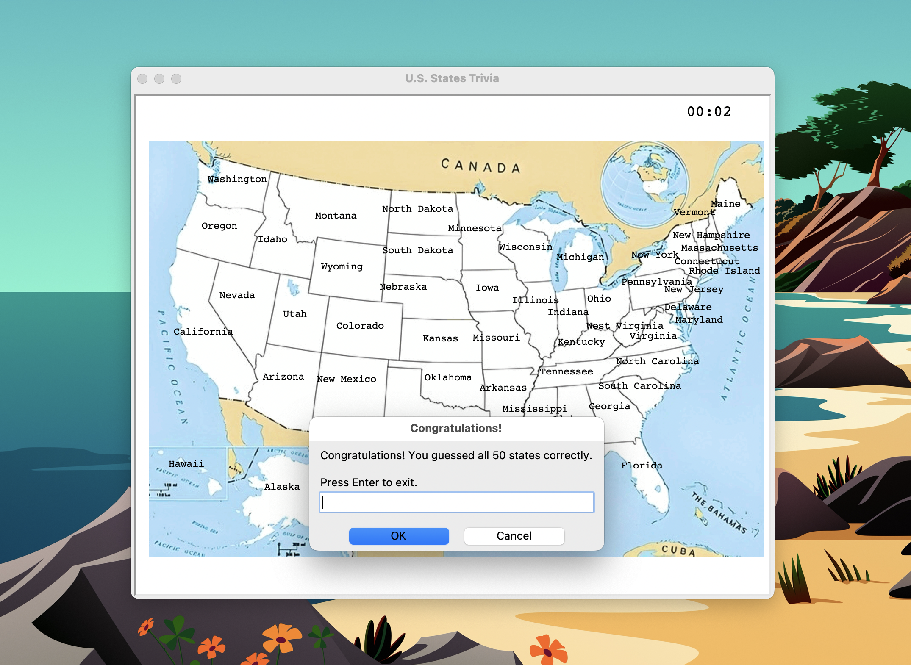
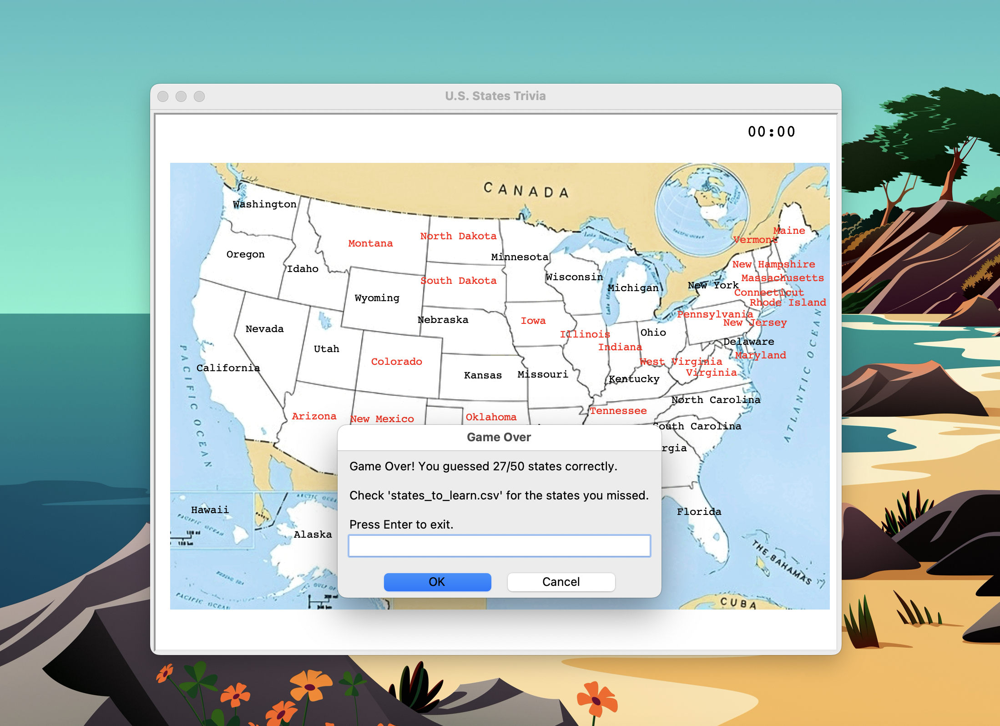

# U.S. States Trivia Game

A fun and interactive game where the user guesses U.S. states based on their location on a map. Includes a timer, hint system, and tracks the score.

## Features

*    Guess states on a U.S. map
*    Timer counts down from 5 minutes
*    Hint system for unguessed states
*    Saves unguessed states to ```states_to_learn.csv``` for learning


## Tools Used
*    Turtle Graphics: For displaying the map and the guessed states.
*    Tkinter: For user input dialog boxes and message boxes.
*    Pandas: For handling CSV files and data manipulation.

## Setup

1. **Clone the repository**
    ```bash
    git clone https://github.com/ser-arthur/us-states-trivia.git
   ```
2. **Go to project directory**
   ```bash
    cd us-states-trivia
   ```
3. **Install dependencies**
   ```bash
    pip install -r requirements.txt
   ```

4. **Run the Game**
   ```bash
   python main.py
   ```

## Visuals
<table>
  <tr>
    <td>
    <td></td>
  </tr>
  <tr>
    <td></td>
  </tr>
</table>

## Author
Kobby S. Arthur

